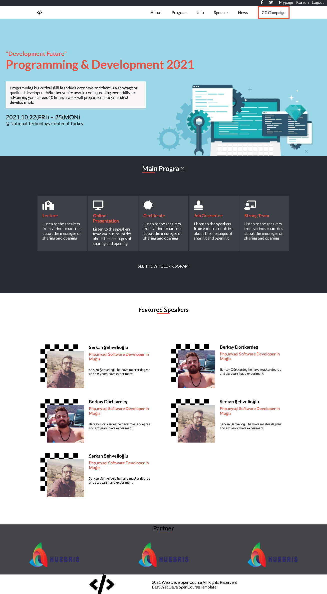

# Module 1: Capstone Project

> Building a personalized Captone-project to review the things learned so as to show an understanding and mastery of fundamentals learned.




## Built With

- HTML5
- CSS3
- JavaScript

## Live Demo

[Live Demo Link](https://atillatahak.github.io/Capstone-WebdeveloperCourse/)

## Presentation

[Video](https://www.loom.com/share/d96c1360bf4546ce85aef70afe8d1095)


## Getting Started

**To get a copy of this repo into your local machine run the following command:**
```
git clone https://github.com/AtillaTahak/Capstone-WebdeveloperCourse.git
cd Capstone-WebdeveloperCourse
in visual studio code you can click the go live button to view it live in the browser.
```


## Authors

👤 **Author**

- GitHub: [@AtillaTahak](https://github.com/AtillaTahak)
- Twitter: [@AtillaTahaa](https://twitter.com/AtillaTahaa)
- LinkedIn: [LinkedIn](https://www.linkedin.com/in/atilla-taha-kördüğüm-a93702186/)
- Blog: [Blog](atillataha.blogspot.com)
- Youtube: [YouTube](https://www.youtube.com/channel/UCmoD0x4Z9vdG2PCsI5p8FYg)

## 🤝 Contributing

Contributions, issues, and feature requests are welcome!

Feel free to check the [issues page](../../issues/).

## Show your support

Give a ⭐️ if you like this project!


## Acknowledgments

- Designed by [Cindy-Shin](https://www.behance.net/gallery/29845175/CC-Global-Summit-2015)


## 📝 License

This project is [MIT](./MIT.md) licensed.
